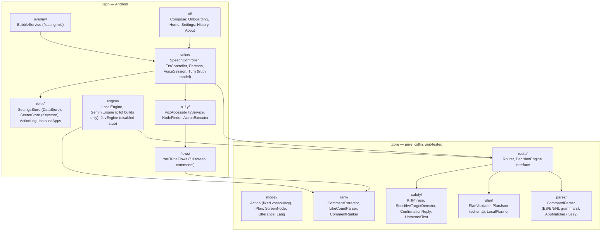
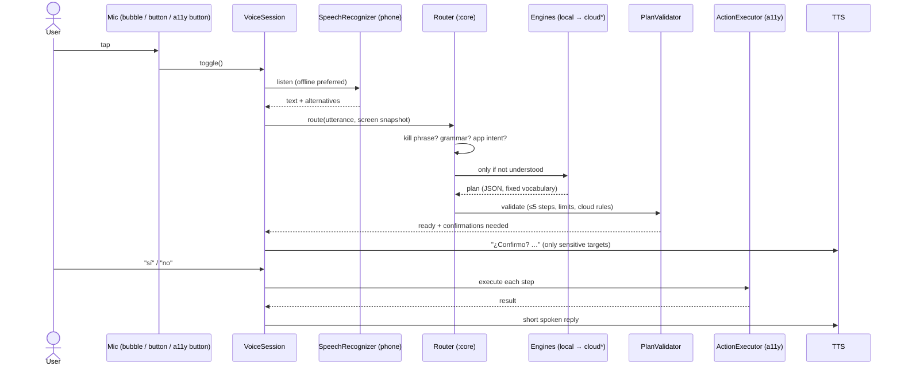
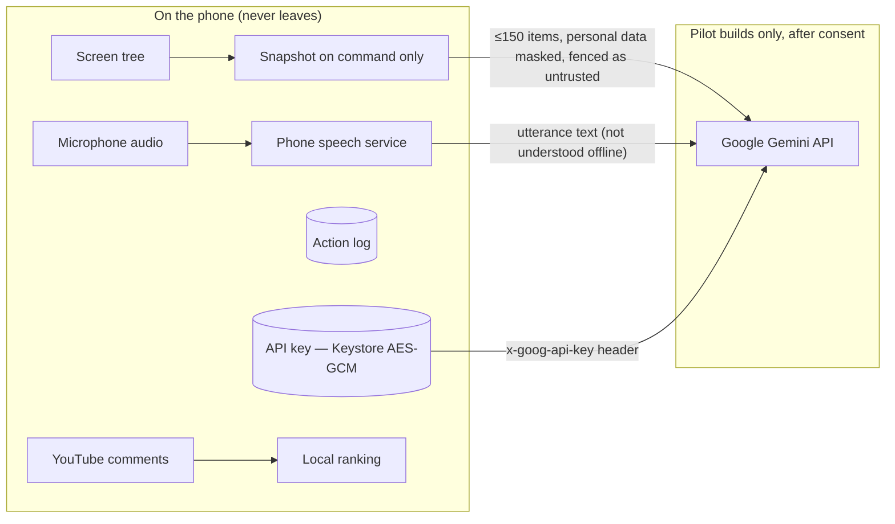

# Architecture

VOZ is two Gradle modules. **`:core`** is pure Kotlin/JVM with zero Android imports and carries all decision logic, so it is fully unit-tested. **`:app`** is the Android shell: accessibility service, voice, UI and adapters. Dependencies are wired by hand (no DI framework).

## Modules

## One voice turn

\* The cloud engine exists only in developer and pilot builds (release builds compile it out). It runs only when the user saved a key, switched it on **and** accepted the consent screen.

## Routing order

1. **Kill phrase** (“para”, “stop”, “stop maar”) → stop immediately.
2. **Offline grammar** for the recognizer’s top hypothesis and up to two alternatives. The utterance language is tried first, then the other two.
3. **App intent**: an installed app name alone opens it; a searchable app name plus words searches inside it.
4. **Decision engines** in order: Local heuristics (say a visible label to tap it) → Jev (disabled stub, skipped) → Gemini (pilot builds, consent given). On-phone brains always go first.
5. **Validator**: action vocabulary, ≤ 5 steps, length limits, no control characters; cloud plans cannot emit `stop`, may only `type` words the user dictated, and need a "yes" to tap a label or search for text the user never said. Taps on sensitive targets need a confirmation, re-checked at runtime against what is really pressed (label, container and its inner texts); identical buttons are never guessed; after "yes" the screen is re-read and the target must be unchanged.

## Privacy boundaries

- Audio is handled by the phone’s speech service; VOZ asks for on-device recognition first.
- The screen is read only when a command needs it. Snapshots are not stored.
- Comments are always ranked locally, even with the cloud on.
- The action log is a local JSON-lines file (max 200 entries); dictated text is logged only as its length.

## Testing

- `:core`: JUnit (Jupiter) table-driven tests for every grammar, the router, validator, plan JSON, ranking, extraction and safety, including adversarial cases (prompt injection in screen text, exfiltration via `type`, out-of-vocabulary plans).
- `:app`: tap resolution on fake view trees (duplicates, re-check after "yes", inner labels, visible-part taps), secret-store contract (real AES-GCM on the JVM), settings codec and consent gate, engine order, action log, Gemini engine against a fake HTTP transport, orb state mapping, settle timing on virtual time, rotation plan, TTS rebuild policy.
- CI (GitHub Actions) runs secret scan, tests, Android lint and builds the debug APK on every push.

## Voice turn state (what the UI may show)

`VoiceSession.turn` is the single source of truth for the screen and the floating mic:
`Listening → Understanding(heard) → Acting(steps, source, index) ⇄ Confirming(what) → Finished(result, reply)`.
`micOpen` is true only between the recognizer's "ready for speech" and the end of the listen, which is when the mic
turns yellow and the start tone plays. `Finished` stays on screen until the next turn, so the last result is always
visible. The UI never shows confidence scores, progress percentages or states the code doesn't measure.
